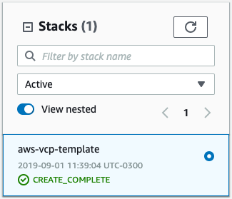

3 - VPC Hands-on
==

Este lab é composto de 2 partes:

1.  Contrução de um template de vpc seguindo as boas práticas da AWS
2.  Criação de uma aplicação básica de testes que rodará dentro dessa VPC

## Construindo a VPC

Para a construição da VPC utilizaremos um template da AWS que cria um ambiente VPC seguindo as boas práticas de segurança e desenvolvimento.

A arquitetura da VPC inclui subnets public e privada. O primeiro conjunto de subnets compartilha uma *network access control list* (`NACL`) padrão da VPC, a segunda, opcionalmente usa um conjunto de subnets privadas que incluem `NACLs` dedicadas por subnet.

Esse template divide o espaço da VPC em um jeito previsível através de multiplas zonas de disponibiidade (`AZ`) e implementa `NAT gatewys` em cada `AZ`, que provê alta disponibilidade de saida de internet para as subnets privadas. A arquitetura criada por esse template pode ser vista na figura a seguir:

### Implantação

1.  No console da AWS, entre no serviço `CloudFormation`
2.  Clique no botão `Create stack`
3.  A próxima página pedirá o preenchimento de duas informações:
    -  `Prerequisite - Prepare template`: selecione a opção **Template is ready**
    -  `Specify template`: selecione **Upload a template file** e clique no botão **Choose file** para fazer o upload do arquivo `aws-vpc-template.json`.
    -  Espere o template terminar o upload e clique no botão `Next`
4. Na página de `Specify stack details`
   - Coloque o nome da stack: **aws-vpc-template**
   - selecione duas ou mais `Availability Zones`
   - selecione o número de `Availability Zones` escolhidas na opção de cima
   - Deixe todas as outras opções no padrão e clique no botão `Next`
 - 5. Clique `Next`
 - 6. Clique em `Create Stack`
 - 7. Aguarde alguns minutos para que todos os elementos do template sejam criados. O tempo médio de criação é de `5 minutos`.

## Construindo a aplicação

Esse template instala e implanta o WordPress em instâncias do Amazon EC2 Amazon RDS para armazenamento.

### Implamtação

1.  No console da AWS, entre no serviço `EC2`
2.  No menu da esquerda, entre em `Key Pairs`
3.  Clique em `Create Key Pair` e de um nome para a chave
    -  Essa chave é usava para acessas a máquina que criaremos no pelo CloudFormation
4.  No console da AWS, entre no serviço `CloudFormation`
5.  Clique no botão `Create stack`
6.  Insira o nome da stack: `wordpress-multiaz`
7.  Procure os campos `DBUser` e `DBPassword` e os preencha com usuário e senha para o banco
8.  Procure os campos `DBSubnets` e escolha 2 as subnets privadas (que terminam com 1A e 2A)
9.  Procure o campo `KeyName` e selecione a keypair criada anteriormente.
10. Procure o `VpcId` e escolha a vpc *aws-vpc-template*, criada anteriormente
11. Procure o `WebServerSubnetId` e escolha um subnet pública (que terminam com 1, 2, 3 ou 4)
12. Clique `Next`
13. Clique `Next`
14. Clique em `Create Stack`
15. Espera mais ou menos 10 minutos para a finalização do template

## Ref
-   https://github.com/aws-quickstart/quickstart-aws-vpc/
-   https://docs.aws.amazon.com/pt_br/AWSCloudFormation/latest/UserGuide/sample-templates-applications-us-east-1.html