4 - Security Hands-on
==

Solução para bloqueio automático de hosts suspeitos, utilizando os serviços AWS GuardDuty e AWS Web Application Firewall (WAF)

## Arquitetura da Solução

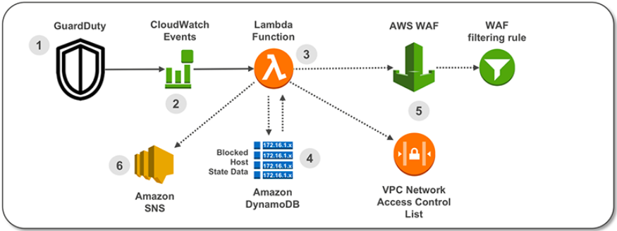

1.    O GuardDuty gera um `finding` sobre alguma atividade maliciosa suspeita;
2.   O CloudWatch Event está configurado para disparar mediante tipos específicos de `findings` gerados pelo GuardDuty; 
3.   Uma função Lambda é chamada pelo CloudWatch Event e analisa o finding do GuardDuty;
4.   Os dados de estado para hosts bloqueados são armazenados em uma tabela do Amazon DynamoDB. Uma segunda função Lambda verifica a tabela de estado quanto à entrada do host existente.
5.   A função Lambda cria uma regra no AWS WAF e em uma VPC NACL.
6.   Um e-mail de notificação é enviado via Amazon Simple Notification Service (SNS).

## Tipos de `findings` utilizados na configuração


-   UnauthorizedAccess:EC2/SSHBruteForce
-   UnauthorizedAccess:EC2/RDPBruteForce
-   Recon:EC2/PortProbeUnprotectedPort
-   Trojan:EC2/BlackholeTraffic
-   Backdoor:EC2/XORDDOS
-   UnauthorizedAccess:EC2/TorIPCaller
-   Trojan:EC2/DropPoint

## Deploy

1.  Abrir pagina do console da AWS.
2.  https://signin.aws.amazon.com
3.  Usar credenciais de acesso.
4.  Conta: immersion-day-si-solvimm
5.  Nome de usuário
6.  Senha
7.  Clicar em fazer Login.
8.  Selecionar a regiao N.Virginia no meunu suspenso
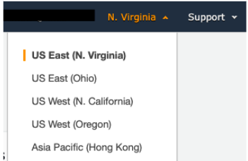
9.  Clicar na barra de busca “Find Services” e digitar “S3”
10.  Clicar em Create Bucket.
11.  Preencher com os dados:
```
Bucket Name = immersion-day-si-solvimm-gd2acl-artifacts-nome-sobrenome
```

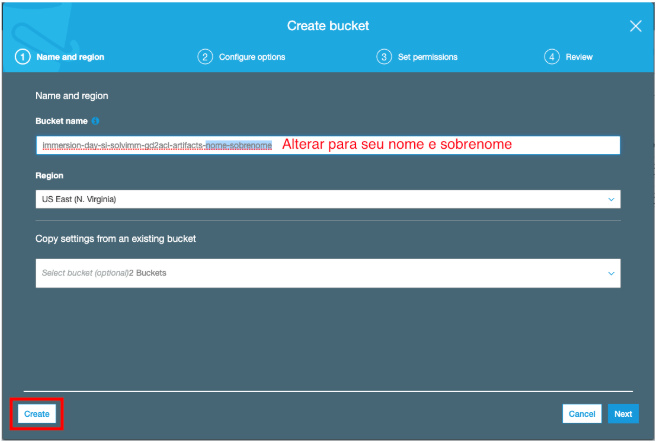

12.  Clicar em Create.
13.  Abrir o bucket que acabou de criar.
14.  Clicar em upload.
15.  Clicar em Add Files.
5.  Selecionar os 2 arquivos zip disponibilizados:
    -   **guardduty_to_acl_lambda.zip**
    -   **prune_old_entries.zip**
16.  Clicar no menu suspenso `Services` e buscar pelo serviço `GuardDuty`.
17. Clicar em Enable GuardDuty.
18. Clicar no menu suspenso `Services` e buscar pelo serviço `Cloudformation`.
19. Clicar em `Create Stack`
20. Clicar em `Upload a template file` e depois em `Choose File`
21. Selecionar o arquivo template fornecido: **aws-guardduty-acl-template**
22. Clicar em `Next`
23. Preencher o próximo campo com as informações abaixo:
    - Stack Name: GuardDutytoACL
    - Notification email (REQUIRED): seu email
    - Retention: 720
    - IP Set for global CloudFront WAF: False
    - IP Set for regional ALB WAF: False
    - S3 bucket for artifacts: immersion-day-si-solvimm-gd2acl-artifacts-nome-sobrenome
    - S3 path to artifacts: <VAZIO>
24.  Clicar em `Next` e na proxima tela `Next` novamente.
25.  Clicar em `Create Stack`
36.  Enquanto a stack estiver sendo criada, vá ao email cadastrado no campo `Notification email`, e procure por um email com o assunto `AWS Notification – Subscription Confirmation`. Entre neste email e confirme clicando no link.

## Para realizar os testes

1.  No painel AWS, clique em Services > VPC > Subnets
2.  Selecione uma subnet para realizar o teste, clicando na aba Summary e copiando o Subnet-ID em um bloco de notas para usar nos próximos passos.
3.  No painel AWS, clique em Services > Cloudformation > GuardDutytoACL stack
4.  Na aba outputs, procure pela Key GuardDutytoACLLambda

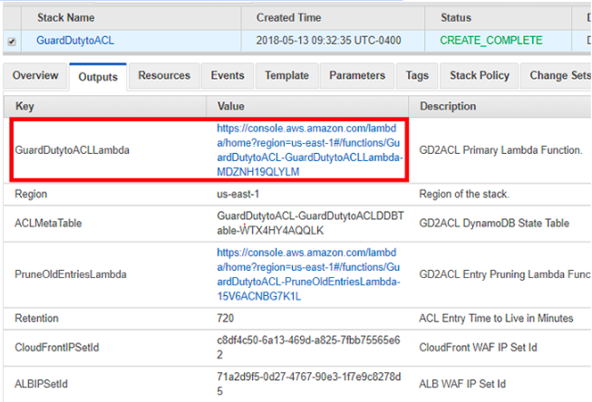

5.  Clique no link para a função Lambda
6.  No topo direito, clique em `Select a test event` e depois na opção `Configure test events`

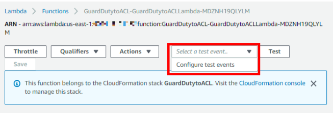

7.  Copie e cole o código fornecido no arquivo `event-test.txt`
8.  Altere o valor do subnetID (linha 34) com o codigo copiado na etapa 2, e clique em `Create`.


1.  Clique em `Teste` para executar. Voce deve receber uma mensagem *Execution result: succeeded*

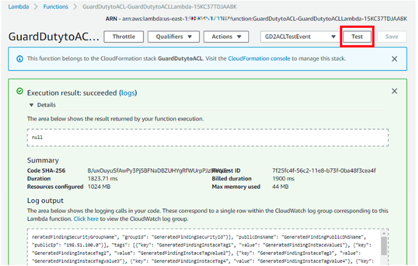

10.  Após executar os testes vamos confirmar os bloqueios no VPC Network ACL (NACL)
12.  No painel, clique em Services > VPC > Subnets
13.  Selecione a subnet utilizada no passo 2, na aba Network ACL
14.  Confirme se a nova entrada foi adicionada.

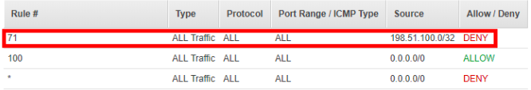

15.  No painel, clique em Services > WAF & Shield , e selecione IP Addresses.
16.  Clique em Filtro, selecione Global (CloudFront), e depois selecione o IPSet chamado GD2ACL CloudFront IPSet for Blacklisted IP addresses.

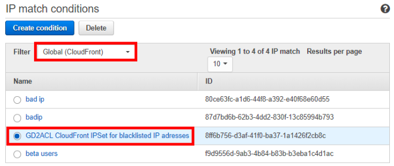

17.  Confirme se o IP foi adicionado a lista de IPSet

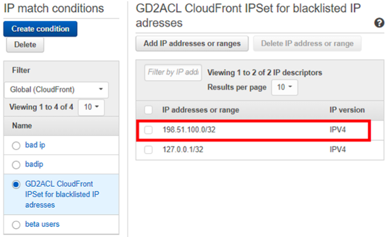

18.  Clique em Filtro, selecione US East (N. Virginia), e depois selecione o IPSet chamado GD2ACL ALB IPSet for Blacklisted IP addresses.

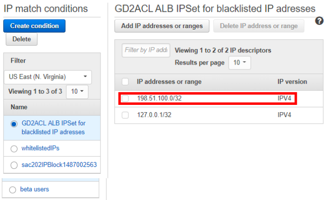

19. Confirme se o IP foi adicionado a lista de IPSet
Entre no email cadastrado para receber as notificações e verifique a mensagem recebida, com o titulo  `AWS GD2ACL Alert`

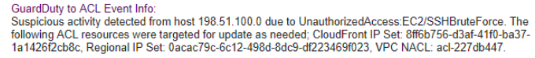

20. Fim